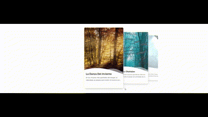

# Form-Animate_spect1


<p align="center" style="color: white;">
    
</p>


<p>
    <a href="https://www.linkedin.com/in/juan-estaban-ar%C3%A9valo-056bab240/" target="_blank" rel="Linkedin">
      
    </a> 
    <a href="https://www.instagram.com/jeacsi.official_022?igsh=MWJ6MHRwcnhoZXVxbQ==" target="_blank" rel="Instagram">
      
    </a>
</p>
<p>Este proyecto es un ejemplo de un carrusel de imágenes implementado utilizando la librería Swiper. Swiper es una de las librerías de carruseles más populares y versátiles para la web, que proporciona una gran cantidad de opciones y configuraciones para crear carruseles personalizados..</p>

```bash
    git clone https://github.com/Juanes200122/Swiper_Carousel.git
    cd Swiper_Carousel
```

## <b> Funcionalidad</b>
<p>Js libreria Swiper</p>
<div style="margin: 20px 0;">
    
</div>

```JS
    var swiper = new Swiper(".swiper-container", {
    effect: "coverflow",
    grabCursor: true,
    centeredSlides: true,
    coverflowEffect: {
        rotate: 0,
        stretch: 0,
        depth: 100,
        modifier: 2.5,
        slideShadows: false 
    },
    keyboard: {
        enabled: true
    },
    mousewheel: {
        thresholdDelta: 70
    },
    spaceBetween: -60,
    loop: false,
    nested: true,
    breakpoints: {
        640: {
            slidesPerView: 2
        },
        1024: {
            slidesPerView: 3
        }
    }
});

```


## <b> Skills</b>
  - 💻 &nbsp;
    
  - 🌐 &nbsp;
    
    
    


